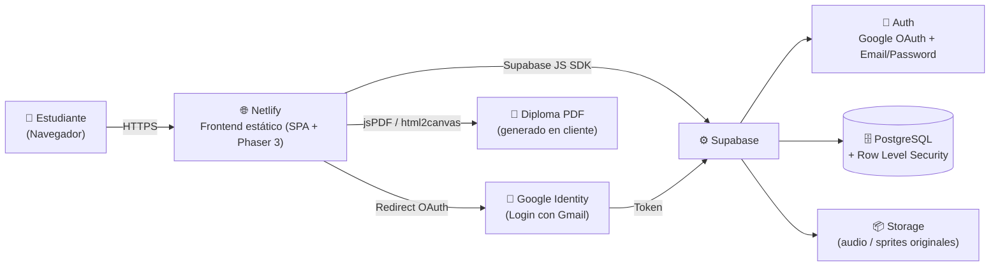
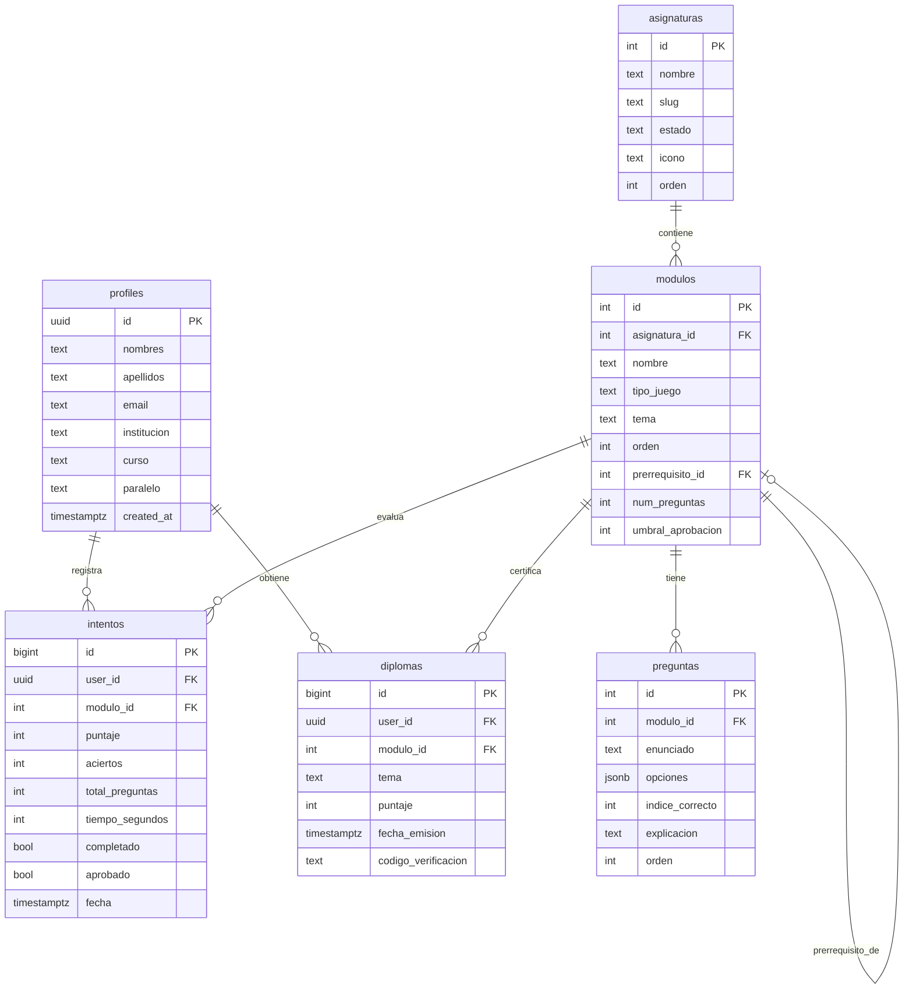
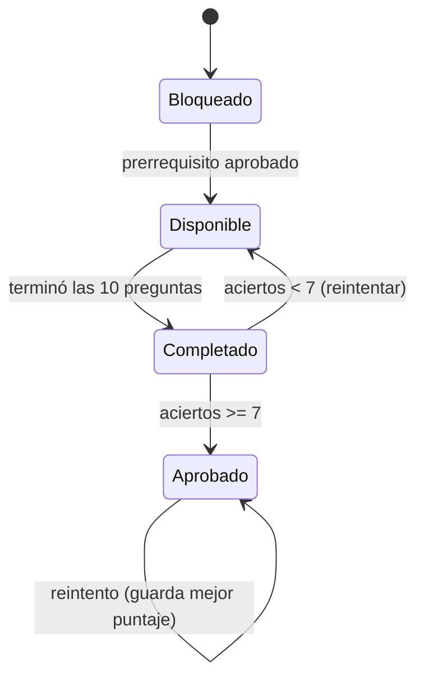
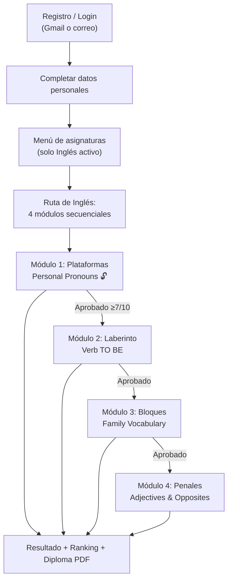

# Especificación de Requisitos de Software (SRS)
## EduPlay UBE — Plataforma Gamificada de Aprendizaje para Primero de Bachillerato (Fase 1: Inglés)

> Documento elaborado bajo el estándar **IEEE 830** adaptado, con secciones complementarias de diseño de videojuegos y guía de construcción para entornos de desarrollo asistido por IA (**Antigravity**).

| Campo | Detalle |
|---|---|
| **Producto** | EduPlay UBE (nombre provisional, configurable) |
| **Versión del documento** | 1.0 |
| **Fecha** | Junio 2026 |
| **Autor / Responsable académico** | Profe. Manuel Reyes |
| **Institución** | Universidad Bolivariana del Ecuador (UBE) |
| **Stack objetivo** | Antigravity (desarrollo) · Netlify (hosting) · Supabase (backend) |
| **Estado** | Aprobado para construcción — Fase 1 |
| **Alcance de esta fase** | Asignatura de **Inglés** (4 módulos basados en videojuegos) |

---

## Tabla de Contenido

1. [Introducción](#1-introducción)
2. [Descripción general](#2-descripción-general)
3. [Requisitos funcionales](#3-requisitos-funcionales)
4. [Requisitos de interfaces externas](#4-requisitos-de-interfaces-externas)
5. [Requisitos no funcionales](#5-requisitos-no-funcionales)
6. [Modelo de datos (Supabase)](#6-modelo-de-datos-supabase)
7. [Diseño técnico de los videojuegos](#7-diseño-técnico-de-los-videojuegos)
8. [Plan de despliegue (Netlify)](#8-plan-de-despliegue-netlify)
9. [Criterios de aceptación y pruebas](#9-criterios-de-aceptación-y-pruebas)
10. [Apéndices](#10-apéndices)

---

## 1. Introducción

### 1.1 Propósito
Este documento define los requisitos funcionales, no funcionales, de datos y de diseño para **EduPlay UBE**, una aplicación web educativa gamificada dirigida a estudiantes de **Primero de Bachillerato**. La aplicación aplica principios de **aprendizaje basado en juegos (Game-Based Learning)** y **diseño instruccional por niveles de dominio**, utilizando la mecánica de videojuegos arcade clásicos como vehículo para la evaluación formativa.

El SRS sirve como contrato técnico-pedagógico y como **prompt maestro de construcción** para ser ejecutado en Antigravity, garantizando que el producto final sea fiel a la intención didáctica.

### 1.2 Alcance del producto
EduPlay UBE ofrecerá:

- Registro e inicio de sesión de estudiantes (Google/Gmail y correo + contraseña).
- Un menú de asignaturas de Primero de Bachillerato.
- En esta **Fase 1**, la asignatura de **Inglés** completamente funcional, compuesta por **4 módulos secuenciales (prerrequisito uno del otro)** basados en videojuegos.
- Sistema de **trivia integrada** dentro de cada videojuego (10 preguntas por módulo).
- **Ranking** por puntaje y tiempo.
- Generación e impresión de **diploma descargable en PDF**.

Las asignaturas restantes (Matemáticas, Historia, Geografía, Lenguaje, Ciencias Naturales) se mostrarán visibles en el menú pero **marcadas como "En construcción"**, sin acceso al contenido.

### 1.3 Definiciones, acrónimos y abreviaturas

| Término | Definición |
|---|---|
| **SRS** | Software Requirement Specification |
| **GBL** | Game-Based Learning (Aprendizaje Basado en Juegos) |
| **RF / RNF** | Requisito Funcional / Requisito No Funcional |
| **Trivia** | Pregunta de opción múltiple disparada por un evento del juego |
| **Módulo** | Unidad de aprendizaje = un videojuego + su banco de 10 preguntas |
| **Prerrequisito** | Módulo que debe aprobarse antes de habilitar el siguiente |
| **Aprobado** | Módulo completado con ≥ 7/10 aciertos (umbral configurable) |
| **RLS** | Row Level Security (seguridad a nivel de fila en PostgreSQL/Supabase) |
| **OAuth** | Protocolo de autorización (usado para login con Google/Gmail) |
| **Antigravity** | Entorno de desarrollo agéntico utilizado para construir la app |

### 1.4 Referencias
- IEEE Std 830-1998 — Recommended Practice for Software Requirements Specifications.
- Documentación oficial de Supabase (Auth, Database, RLS, Storage, Edge Functions).
- Documentación de Netlify (deploy de sitios estáticos, variables de entorno, redirects).
- Documentación de Phaser 3 (motor de videojuegos HTML5 recomendado).
- Marco curricular del Ministerio de Educación del Ecuador para Primero de Bachillerato (área de Lengua Extranjera — Inglés).

### 1.5 ⚠️ Consideraciones de Propiedad Intelectual (Lectura obligatoria)
Los módulos de esta plataforma se **inspiran en la mecánica de juego (gameplay)** de géneros arcade clásicos: plataformas de desplazamiento lateral, laberinto/persecución, bloques que caen y tiro penal. **Las mecánicas de juego y los géneros no son objeto de derechos de autor**, pero **los personajes, nombres comerciales, sprites, música y diseños de nivel originales sí lo son**.

Por ello, este SRS especifica que **TODOS los activos (personajes, arte, sonido, música, nombres y diseños de nivel) deben ser ORIGINALES o de licencia libre (CC0 / dominio público / royalty-free)**. **Queda prohibido reproducir o copiar**:

- Personajes o sprites de marcas registradas (p. ej., el fontanero de Nintendo, el comecocos de Bandai Namco).
- Nombres comerciales registrados de los juegos originales como nombre del producto.
- Música o efectos de sonido originales de dichos títulos.
- Diseños de nivel idénticos a los originales protegidos.

Esto protege legalmente a la UBE, permite que la institución **sea propietaria de la obra** y posibilita su publicación. Cada módulo recibe en este documento un **nombre y personaje original** que conserva la jugabilidad deseada. Esta decisión es, además, una buena práctica de la industria EdTech.

### 1.6 Visión general del documento
La sección 2 describe el producto en alto nivel y su arquitectura. La sección 3 detalla los requisitos funcionales (incluyendo cada videojuego). Las secciones 4 y 5 abordan interfaces y atributos de calidad. La sección 6 define el modelo de datos en Supabase con DDL y RLS listos para ejecutar. La sección 7 entrega el diseño técnico de los juegos. Las secciones 8–10 cubren despliegue, pruebas y apéndices (incluido el banco de 40 preguntas).

---

## 2. Descripción general

### 2.1 Perspectiva del producto
EduPlay UBE es una **aplicación web SPA (Single Page Application)** estática, desplegada en Netlify, que consume un backend gestionado en Supabase mediante el SDK de JavaScript. No requiere servidor propio; toda la lógica de negocio sensible se protege con políticas RLS y, donde aplique, funciones `SECURITY DEFINER`.

### 2.2 Arquitectura tecnológica



| Capa | Tecnología | Responsabilidad |
|---|---|---|
| **Desarrollo** | Antigravity | Construcción asistida por IA del frontend y la integración |
| **Frontend** | HTML5 + CSS3 + JavaScript (Vite recomendado) | UI, navegación, menú, ranking, diploma |
| **Motor de juegos** | **Phaser 3** (HTML5 Canvas/WebGL) | Animación, física, sonido y escenas de los 4 juegos |
| **Hosting** | Netlify | Despliegue estático, variables de entorno, redirects SPA |
| **Backend** | Supabase | Autenticación, base de datos PostgreSQL, RLS, Storage |
| **Autenticación** | Supabase Auth + Google OAuth | Login con Gmail y registro con correo/contraseña |
| **Generación PDF** | jsPDF + html2canvas (en cliente) | Diploma descargable |

> **Nota de motor:** Se recomienda **Phaser 3** por ser de código abierto (MIT), gratuito y manejar sprites, físicas arcade, audio multicanal y escenas, lo cual cubre los cuatro géneros requeridos. Alternativa válida: Canvas API nativo. **No** usar motores ni assets con restricciones de licencia.

### 2.3 Funciones principales
1. **Autenticación y registro** con formulario de datos personales + Gmail.
2. **Menú lateral izquierdo** de asignaturas (Inglés activo; resto "En construcción").
3. **Ruta de aprendizaje de Inglés** con 4 módulos secuenciales bloqueados por prerrequisito.
4. **Videojuegos animados y sonorizados** con trivia integrada (10 preguntas c/u).
5. **Cálculo de puntaje y tiempo** por intento.
6. **Ranking/Leaderboard** por puntaje y tiempo.
7. **Emisión y descarga de diploma PDF** al completar cada módulo.

### 2.4 Características de los usuarios

| Rol | Descripción | Capacidades |
|---|---|---|
| **Estudiante** | Alumno de Primero de Bachillerato | Registrarse, iniciar sesión, jugar módulos, ver su progreso/ranking, descargar diplomas |
| **Visitante** | Usuario no autenticado | Solo puede ver la pantalla de login/registro |
| **Administrador académico** *(implícito)* | Profe. Manuel Reyes | Gestión de contenido vía Supabase (banco de preguntas, estados de asignatura). *No requiere panel propio en Fase 1.* |

Perfil del estudiante: 14–16 años, competencia digital básica, dispositivos de escritorio y/o tablet, nivel de inglés A1–A2.

### 2.5 Restricciones
- **R-01** Despliegue obligatorio en **Netlify**; backend obligatorio en **Supabase**.
- **R-02** Autenticación debe incluir **Google/Gmail** (OAuth) y registro con correo/contraseña.
- **R-03** Solo se desarrolla **Inglés** en esta fase; otras asignaturas en estado "construcción".
- **R-04** Los 4 módulos son **estrictamente secuenciales** (prerrequisito uno del otro).
- **R-05** Cada módulo tiene exactamente **10 preguntas**.
- **R-06** **Todos los activos deben ser originales o de licencia libre** (ver §1.5).
- **R-07** Generación de PDF en **cliente** (sin costo de servidor).
- **R-08** Uso de **niveles gratuitos** (free tier) de Supabase y Netlify.

### 2.6 Suposiciones y dependencias
- El estudiante posee una cuenta de Google (Gmail) o un correo válido.
- Existe conexión a Internet estable durante el juego.
- Las claves públicas de Supabase (`SUPABASE_URL`, `SUPABASE_ANON_KEY`) se inyectan como variables de entorno en Netlify.
- El navegador soporta HTML5 Canvas/WebGL y Web Audio API.

---

## 3. Requisitos funcionales

> Prioridad: **A** = Alta (imprescindible Fase 1), **M** = Media, **B** = Baja.

### 3.1 Autenticación y registro

| ID | Requisito | Prioridad |
|---|---|---|
| RF-001 | El sistema debe permitir **registro con correo electrónico y contraseña** mediante un **formulario de datos personales** (ver RF-003). | A |
| RF-002 | El sistema debe permitir **inicio de sesión y registro con Google/Gmail** vía Supabase Auth (OAuth). Tras el primer login con Google, si el perfil no está completo, se solicita completar datos personales faltantes. | A |
| RF-003 | El **formulario de datos personales** debe capturar: nombres, apellidos, correo (Gmail), institución (precargada: "Universidad Bolivariana del Ecuador (UBE)"), curso (precargado: "Primero de Bachillerato") y paralelo. | A |
| RF-004 | El sistema debe **validar** campos obligatorios, formato de correo y longitud mínima de contraseña (≥ 8 caracteres). | A |
| RF-005 | El sistema debe permitir **cerrar sesión** y mantener la sesión persistente entre recargas (token gestionado por Supabase). | A |
| RF-006 | El sistema debe ofrecer recuperación de contraseña por correo (flujo nativo de Supabase). | M |
| RF-007 | Tras autenticarse, se crea/actualiza automáticamente el registro en la tabla `profiles` asociado al `auth.uid()`. | A |

### 3.2 Gestión de perfil

| ID | Requisito | Prioridad |
|---|---|---|
| RF-008 | El estudiante debe poder **ver y editar** sus datos personales (excepto correo de Gmail vinculado por OAuth). | M |
| RF-009 | El sistema debe mostrar un **avatar** (inicial o imagen de Google si está disponible). | B |

### 3.3 Navegación y menú de asignaturas

| ID | Requisito | Prioridad |
|---|---|---|
| RF-010 | La aplicación debe presentar un **menú lateral izquierdo (sidebar)** con las asignaturas de Primero de Bachillerato en este orden: **Matemáticas, Historia, Geografía, Lenguaje, Inglés, Ciencias Naturales**. | A |
| RF-011 | Solo **Inglés** debe estar **habilitado y navegable**. Las demás deben mostrar una etiqueta/insignia visible **"En construcción 🚧"** y, al hacer clic, un aviso "Esta asignatura estará disponible próximamente". | A |
| RF-012 | El sidebar debe ser **responsivo** (colapsable en pantallas pequeñas / menú hamburguesa). | M |
| RF-013 | El sidebar debe resaltar la asignatura activa y mostrar el avance del estudiante en Inglés (módulos completados / 4). | M |

### 3.4 Módulos de Inglés y prerrequisitos

| ID | Requisito | Prioridad |
|---|---|---|
| RF-014 | Al ingresar a **Inglés**, se muestra una **ruta de 4 módulos** en orden: (1) Personal Pronouns, (2) Verb TO BE, (3) Family Vocabulary, (4) Adjectives and opposites. | A |
| RF-015 | Los módulos son **prerrequisito uno del otro**: el Módulo *n+1* permanece **bloqueado** (candado 🔒) hasta que el Módulo *n* esté **APROBADO** (≥ 7/10 aciertos, umbral configurable). | A |
| RF-016 | El Módulo 1 está **siempre desbloqueado** para todo estudiante autenticado. | A |
| RF-017 | El estado de cada módulo (Bloqueado / Disponible / Completado / Aprobado) debe **persistir** por usuario en la base de datos y reflejarse al volver a iniciar sesión. | A |
| RF-018 | El estudiante debe poder **reintentar** un módulo ya aprobado; se conserva su **mejor intento** para el ranking. | M |

### 3.5 Mecánica de trivia (común a los 4 juegos)

| ID | Requisito | Prioridad |
|---|---|---|
| RF-019 | Cada módulo contiene exactamente **10 preguntas** de opción múltiple (4 alternativas), cargadas desde la tabla `preguntas`. | A |
| RF-020 | La trivia se **dispara por un evento propio del juego** (recoger moneda / recoger fruta / completar línea / patear penal). Al dispararse, el juego **pausa** y se superpone un **modal de pregunta**. | A |
| RF-021 | **Respuesta correcta:** suma puntaje (+100), reproduce sonido/animación de acierto y el juego continúa con la recompensa correspondiente (moneda recogida, gol anotado, etc.). | A |
| RF-022 | **Respuesta incorrecta:** no suma puntaje, reproduce sonido/animación de error y aplica la penalización propia del juego (ver cada juego). | A |
| RF-023 | Las preguntas deben presentarse en **orden aleatorio** y sin repetición dentro del mismo intento. | M |
| RF-024 | El sistema debe llevar el conteo en pantalla (HUD): **preguntas respondidas / 10**, **aciertos**, **puntaje** y **cronómetro**. | A |
| RF-025 | El **cronómetro inicia** al comenzar el juego y **se detiene** al completar las 10 preguntas o finalizar el nivel. | A |

### 3.6 Módulo 1 — Juego de plataformas · *"Pixel Run: Pronouns"* (Personal Pronouns)

> **Inspirado en** el género de plataformas de desplazamiento lateral. Personaje y arte **originales** (mascota: "Lexi"). **No** reproducir personajes ni niveles de marcas registradas.

| ID | Requisito | Prioridad |
|---|---|---|
| RF-026 | Nivel de **scroll horizontal** desde un punto de inicio hasta una meta (bandera/portal). | A |
| RF-027 | El personaje se **mueve** (izquierda/derecha) y **salta** sobre plataformas; física arcade (gravedad, colisiones). | A |
| RF-028 | A lo largo del nivel se distribuyen **10 monedas**. **Cada moneda recogida dispara una trivia** sobre *Personal Pronouns*. | A |
| RF-029 | **Acierto:** la moneda se contabiliza y suena efecto; **error:** la moneda no se contabiliza (o se pierde una vida) y suena efecto de error. | A |
| RF-030 | El nivel **termina** al recoger/responder las 10 monedas y alcanzar la meta. | A |
| RF-031 | **Controles:** Teclado (← → / A D mover, Espacio o ↑ saltar) y **táctil** (botones en pantalla para móvil/tablet). | A |
| RF-032 | Activos requeridos (originales/CC0): sprite de personaje con animación de correr/saltar, tiles de plataforma, moneda animada, fondo con parallax, música de fondo y SFX (salto, moneda, acierto, error, victoria). | A |

### 3.7 Módulo 2 — Juego de laberinto · *"Maze Muncher: TO BE"* (Verb TO BE)

> **Inspirado en** el género de laberinto/persecución. Personaje y laberinto **originales** (mascota: "Gobo"). **No** reproducir el comecocos ni laberintos de marcas registradas.

| ID | Requisito | Prioridad |
|---|---|---|
| RF-033 | El personaje navega un **laberinto** recogiendo **10 frutas** distribuidas, evitando 1–3 enemigos perseguidores. | A |
| RF-034 | **Cada fruta recogida muestra una pantalla/modal de trivia** sobre *Verb TO BE*. | A |
| RF-035 | **Acierto:** la fruta cuenta y suena efecto; **error:** la fruta no cuenta y el/los enemigos aceleran temporalmente (penalización). | A |
| RF-036 | Si un enemigo atrapa al personaje, se pierde una vida; con vidas configurables (p. ej., 3). Agotadas las vidas, el intento se reinicia sin guardar como aprobado. | M |
| RF-037 | El nivel **termina** al recoger/responder las 10 frutas. | A |
| RF-038 | **Controles:** Teclado (flechas / WASD) y **táctil** (D-pad en pantalla). | A |
| RF-039 | Activos requeridos (originales/CC0): sprite del personaje, sprites de enemigos con IA simple de persecución, frutas, paredes/laberinto, música y SFX (movimiento, fruta, atrapado, acierto, error). | A |

### 3.8 Módulo 3 — Juego de bloques · *"Block Stack: Family"* (Family Vocabulary)

> **Inspirado en** el género de bloques que caen. Piezas y estética **originales**. **No** usar nombre comercial registrado ni assets protegidos.

| ID | Requisito | Prioridad |
|---|---|---|
| RF-040 | Piezas geométricas caen en un tablero; el jugador las **mueve y rota** para **completar líneas** horizontales. | A |
| RF-041 | **Por cada línea completada se dispara una trivia** sobre *Family Vocabulary*. | A |
| RF-042 | **Acierto:** la línea se elimina, suma puntaje y suena efecto; **error:** la línea **no** se elimina (penalización: el tablero queda más lleno) y suena efecto de error. | A |
| RF-043 | El módulo **termina** al responder las **10 preguntas** (es decir, tras 10 disparos de trivia por líneas) o si el tablero se llena (game over → reintentar). | A |
| RF-044 | La velocidad de caída es moderada y **configurable** (apta para bachillerato; el foco es la trivia, no la dificultad extrema). | M |
| RF-045 | **Controles:** Teclado (← → mover, ↑ rotar, ↓ caída suave) y **táctil** (botones mover/rotar/bajar). | A |
| RF-046 | Activos requeridos (originales/CC0): piezas/bloques con paleta propia, tablero, música de fondo, SFX (mover, rotar, línea, acierto, error, game over). | A |

### 3.9 Módulo 4 — Juego de penales · *"Penalty Master: Opposites"* (Adjectives and opposites)

> Mecánica **original** (tiro penal). Sin dependencias de IP de terceros.

| ID | Requisito | Prioridad |
|---|---|---|
| RF-047 | El jugador ejecuta **10 penales** contra un arquero. **Antes de cada disparo se presenta una trivia** sobre *Adjectives and opposites*. | A |
| RF-048 | **Acierto:** se habilita el disparo y **se anota el gol** (animación + sonido de gol y ovación). **Error:** el **arquero ataja** el balón (animación de atajada + sonido). | A |
| RF-049 | El jugador elige **dirección y potencia** del disparo (clic/arrastre o botones); el resultado del gol depende exclusivamente del acierto en la trivia (la mecánica de puntería es estética/secundaria, configurable). | A |
| RF-050 | El módulo **termina** tras los 10 penales; se registran goles (= aciertos) y puntaje. | A |
| RF-051 | **Controles:** Ratón/táctil (seleccionar zona del arco y potencia) y teclado como alternativa. | A |
| RF-052 | Activos requeridos (originales/CC0): arquero animado (atajada/gol encajado), portería, balón, cancha, música y SFX (patada, gol, atajada, ovación, error). | A |

### 3.10 Sistema de puntaje y tiempo

| ID | Requisito | Prioridad |
|---|---|---|
| RF-053 | **Puntaje por acierto:** +100 puntos. Error: 0 puntos. | A |
| RF-054 | **Bonus por tiempo:** al finalizar el módulo se otorga un bonus = `max(0, (tiempo_objetivo − tiempo_real)) × factor`. `tiempo_objetivo` y `factor` configurables por módulo (valores por defecto en §7.4). | M |
| RF-055 | **Puntaje final del intento** = (aciertos × 100) + bonus_tiempo. | A |
| RF-056 | Se registran por intento: `aciertos`, `total_preguntas` (10), `puntaje`, `tiempo_segundos`, `completado`, `aprobado` (≥ 7/10) y `fecha`. | A |
| RF-057 | Se conserva el **mejor intento** por usuario y módulo para efectos de ranking. | A |

### 3.11 Ranking / Leaderboard

| ID | Requisito | Prioridad |
|---|---|---|
| RF-058 | El sistema debe mostrar un **ranking por módulo** ordenado **primero por puntaje (desc)** y, en empate, **por menor tiempo (asc)**. | A |
| RF-059 | Debe existir además un **ranking global** (suma de mejores puntajes de los 4 módulos por estudiante). | M |
| RF-060 | El ranking debe mostrar: posición, nombre del estudiante (nombre + inicial del apellido por privacidad), puntaje y tiempo. | A |
| RF-061 | El ranking se obtiene mediante una **función `SECURITY DEFINER`** que respeta la privacidad (ver §6) — los estudiantes no pueden leer datos crudos de otros perfiles. | A |
| RF-062 | El estudiante debe poder ver **su propia posición** resaltada. | M |

### 3.12 Generación de diploma PDF

| ID | Requisito | Prioridad |
|---|---|---|
| RF-063 | Al **completar cada módulo**, el sistema debe **generar e imprimir un diploma** y permitir **descargarlo en PDF**. | A |
| RF-064 | El diploma debe contener: nombre completo del **estudiante**; nombre del **profesor responsable: "Profe. Manuel Reyes"**; **institución: "Universidad Bolivariana del Ecuador (UBE)"**; **fecha** de emisión; **tema completado** (p. ej., "Personal Pronouns"); puntaje obtenido y un **código de verificación** único. | A |
| RF-065 | El PDF se genera **en el cliente** (jsPDF + html2canvas a partir de una plantilla HTML estilizada con identidad UBE). | A |
| RF-066 | Cada emisión de diploma se **registra** en la tabla `diplomas` (auditoría). | M |
| RF-067 | El diploma debe verse correctamente en formato **horizontal (A4 landscape)** con bordes, sellos/logotipo institucional (placeholder de logo UBE) y tipografía legible. | M |

---

## 4. Requisitos de interfaces externas

### 4.1 Interfaces de usuario (UI/UX)
- **Pantalla de Login/Registro:** alternancia entre "Iniciar sesión" y "Registrarse"; botón destacado **"Continuar con Google"**; formulario de datos personales (RF-003).
- **Layout principal:** sidebar izquierdo (asignaturas) + área de contenido. Cabecera con avatar, nombre y botón de cerrar sesión.
- **Vista de asignatura Inglés:** tarjetas de los 4 módulos con estado visual (🔓 disponible, 🔒 bloqueado, ✅ aprobado), tema y botón "Jugar".
- **Vista de juego:** canvas del juego a pantalla mayoritaria + HUD (preguntas/10, aciertos, puntaje, cronómetro) + botón de salir/pausa.
- **Modal de trivia:** enunciado, 4 opciones (botones grandes, accesibles), retroalimentación inmediata (acierto/error).
- **Vista de resultados:** resumen del intento + acceso al **ranking** + botón **"Descargar diploma (PDF)"**.
- **Identidad visual:** paleta y tipografía coherentes; uso de la **identidad institucional roja y blanca de la UBE** (placeholder de logotipo).
- **Diseño responsivo:** escritorio (prioritario) y tablet; controles táctiles para los juegos en pantallas pequeñas.

### 4.2 Interfaces de software

| Interfaz | Detalle |
|---|---|
| **Supabase JS SDK** (`@supabase/supabase-js`) | Auth, consultas a BD, RPC (función de ranking), Storage |
| **Google OAuth** (vía Supabase Auth providers) | Login con Gmail |
| **Phaser 3** | Motor de los videojuegos (escenas, sprites, física arcade, audio) |
| **jsPDF + html2canvas** | Generación de diploma PDF en cliente |
| **Web Audio API** | Reproducción de música y SFX |

### 4.3 Interfaces de comunicación
- Comunicación **HTTPS** entre frontend (Netlify) y Supabase.
- **OAuth redirect** entre la app y Google Identity, configurando las **Redirect URLs** autorizadas en Supabase y en Google Cloud Console (dominio de Netlify).

---

## 5. Requisitos no funcionales

| ID | Categoría | Requisito |
|---|---|---|
| RNF-01 | **Rendimiento** | Los juegos deben aspirar a **60 FPS** en hardware de gama media; carga inicial < 5 s con conexión estándar. |
| RNF-02 | **Usabilidad** | Interfaz intuitiva para estudiantes de 14–16 años; máximo 3 clics para empezar a jugar tras iniciar sesión. |
| RNF-03 | **Animación y sonido** | **Todos los juegos deben ser animados y sonorizados** (música de fondo + SFX), con opción de **silenciar (mute)**. |
| RNF-04 | **Accesibilidad** | Contraste adecuado, botones de trivia grandes, texto legible; soporte de teclado y táctil. |
| RNF-05 | **Compatibilidad** | Navegadores modernos (Chrome, Edge, Firefox, Safari) en escritorio y tablet; WebGL/Canvas + Web Audio. |
| RNF-06 | **Seguridad** | Datos protegidos con **RLS**; ningún estudiante accede a datos de otro; secretos del lado servidor nunca en el cliente; solo `ANON_KEY` pública. |
| RNF-07 | **Privacidad** | El ranking expone únicamente nombre + inicial del apellido. Cumplimiento de buenas prácticas de protección de datos de menores. |
| RNF-08 | **Disponibilidad** | Hosting en Netlify (alta disponibilidad CDN) y backend gestionado por Supabase. |
| RNF-09 | **Mantenibilidad** | Código modular (un archivo/escena por juego); banco de preguntas editable en BD sin recompilar. |
| RNF-10 | **Escalabilidad** | Arquitectura preparada para añadir nuevas asignaturas/módulos reutilizando el modelo de datos. |
| RNF-11 | **Internacionalización** | UI en **español**; contenido evaluado en **inglés** (los enunciados de trivia están en inglés). |
| RNF-12 | **Costo** | Uso de niveles gratuitos de Netlify y Supabase; activos de licencia libre. |

---

## 6. Modelo de datos (Supabase)

### 6.1 Diagrama Entidad-Relación



### 6.2 Esquema SQL (DDL + RLS) — listo para Supabase SQL Editor

```sql
-- =========================================================
-- EduPlay UBE — Esquema de base de datos (Supabase / PostgreSQL)
-- =========================================================

-- ---------- TABLA: profiles ----------
create table if not exists public.profiles (
  id           uuid primary key references auth.users(id) on delete cascade,
  nombres      text not null,
  apellidos    text not null,
  email        text not null,
  institucion  text not null default 'Universidad Bolivariana del Ecuador (UBE)',
  curso        text not null default 'Primero de Bachillerato',
  paralelo     text,
  avatar_url   text,
  created_at   timestamptz not null default now()
);

-- ---------- TABLA: asignaturas ----------
create table if not exists public.asignaturas (
  id      serial primary key,
  nombre  text not null,
  slug    text not null unique,
  estado  text not null default 'construccion'
          check (estado in ('activa','construccion')),
  icono   text,
  orden   int  not null default 0
);

-- ---------- TABLA: modulos ----------
create table if not exists public.modulos (
  id                serial primary key,
  asignatura_id     int  not null references public.asignaturas(id) on delete cascade,
  nombre            text not null,
  tipo_juego        text not null
                    check (tipo_juego in ('plataformas','laberinto','bloques','penales')),
  tema              text not null,
  orden             int  not null,
  prerrequisito_id  int  references public.modulos(id),
  num_preguntas     int  not null default 10,
  umbral_aprobacion int  not null default 7
);

-- ---------- TABLA: preguntas ----------
create table if not exists public.preguntas (
  id              serial primary key,
  modulo_id       int  not null references public.modulos(id) on delete cascade,
  enunciado       text not null,
  opciones        jsonb not null,          -- ej: ["I","He","They","We"]
  indice_correcto int  not null,           -- 0..3
  explicacion     text,
  orden           int
);

-- ---------- TABLA: intentos ----------
create table if not exists public.intentos (
  id              bigserial primary key,
  user_id         uuid not null references auth.users(id) on delete cascade,
  modulo_id       int  not null references public.modulos(id) on delete cascade,
  puntaje         int  not null default 0,
  aciertos        int  not null default 0,
  total_preguntas int  not null default 10,
  tiempo_segundos int  not null,
  completado      boolean not null default false,
  aprobado        boolean not null default false,
  fecha           timestamptz not null default now()
);

-- ---------- TABLA: diplomas ----------
create table if not exists public.diplomas (
  id                  bigserial primary key,
  user_id             uuid not null references auth.users(id) on delete cascade,
  modulo_id           int  not null references public.modulos(id),
  tema                text not null,
  puntaje             int,
  fecha_emision       timestamptz not null default now(),
  codigo_verificacion text unique
);

-- =========================================================
-- ROW LEVEL SECURITY
-- =========================================================
alter table public.profiles    enable row level security;
alter table public.asignaturas enable row level security;
alter table public.modulos     enable row level security;
alter table public.preguntas   enable row level security;
alter table public.intentos    enable row level security;
alter table public.diplomas    enable row level security;

-- profiles: cada usuario gestiona SOLO su propio perfil
create policy "perfil_select_propio" on public.profiles
  for select using (auth.uid() = id);
create policy "perfil_insert_propio" on public.profiles
  for insert with check (auth.uid() = id);
create policy "perfil_update_propio" on public.profiles
  for update using (auth.uid() = id) with check (auth.uid() = id);

-- contenido de catálogo: lectura para usuarios autenticados
create policy "asignaturas_lectura" on public.asignaturas
  for select using (auth.role() = 'authenticated');
create policy "modulos_lectura" on public.modulos
  for select using (auth.role() = 'authenticated');
create policy "preguntas_lectura" on public.preguntas
  for select using (auth.role() = 'authenticated');

-- intentos: cada usuario inserta/lee SOLO los suyos
create policy "intentos_insert_propio" on public.intentos
  for insert with check (auth.uid() = user_id);
create policy "intentos_select_propio" on public.intentos
  for select using (auth.uid() = user_id);

-- diplomas: cada usuario inserta/lee SOLO los suyos
create policy "diplomas_insert_propio" on public.diplomas
  for insert with check (auth.uid() = user_id);
create policy "diplomas_select_propio" on public.diplomas
  for select using (auth.uid() = user_id);

-- =========================================================
-- FUNCIÓN DE RANKING (SECURITY DEFINER) — respeta privacidad
-- Devuelve el mejor intento por usuario para un módulo dado.
-- =========================================================
create or replace function public.get_leaderboard(p_modulo_id int)
returns table(
  posicion        bigint,
  estudiante      text,
  puntaje         int,
  tiempo_segundos int,
  fecha           timestamptz
)
language sql
security definer
set search_path = public
as $$
  with mejores as (
    select distinct on (i.user_id)
      i.user_id,
      i.puntaje,
      i.tiempo_segundos,
      i.fecha,
      (pr.nombres || ' ' || left(pr.apellidos, 1) || '.') as estudiante
    from public.intentos i
    join public.profiles pr on pr.id = i.user_id
    where i.modulo_id = p_modulo_id
      and i.completado = true
    order by i.user_id, i.puntaje desc, i.tiempo_segundos asc
  )
  select
    row_number() over (order by puntaje desc, tiempo_segundos asc) as posicion,
    estudiante, puntaje, tiempo_segundos, fecha
  from mejores
  order by puntaje desc, tiempo_segundos asc;
$$;

-- Ranking global (suma de mejores puntajes por estudiante en los 4 módulos)
create or replace function public.get_leaderboard_global()
returns table(posicion bigint, estudiante text, puntaje_total bigint)
language sql
security definer
set search_path = public
as $$
  with mejores as (
    select distinct on (i.user_id, i.modulo_id)
      i.user_id, i.modulo_id, i.puntaje,
      (pr.nombres || ' ' || left(pr.apellidos, 1) || '.') as estudiante
    from public.intentos i
    join public.profiles pr on pr.id = i.user_id
    where i.completado = true
    order by i.user_id, i.modulo_id, i.puntaje desc, i.tiempo_segundos asc
  ),
  sumas as (
    select user_id, max(estudiante) as estudiante, sum(puntaje)::bigint as puntaje_total
    from mejores group by user_id
  )
  select row_number() over (order by puntaje_total desc) as posicion,
         estudiante, puntaje_total
  from sumas order by puntaje_total desc;
$$;
```

> **Uso del ranking desde el frontend (RPC):**
> `const { data } = await supabase.rpc('get_leaderboard', { p_modulo_id: 1 });`

### 6.3 Datos semilla (seed)

```sql
-- Asignaturas (orden y estados segun requisito)
insert into public.asignaturas (nombre, slug, estado, icono, orden) values
  ('Matemáticas',       'matematicas',       'construccion', '➗', 1),
  ('Historia',          'historia',          'construccion', '📜', 2),
  ('Geografía',         'geografia',         'construccion', '🌍', 3),
  ('Lenguaje',          'lenguaje',          'construccion', '📖', 4),
  ('Inglés',            'ingles',            'activa',       '🇬🇧', 5),
  ('Ciencias Naturales','ciencias-naturales','construccion', '🔬', 6);

-- Módulos de Inglés (secuenciales: cada uno requiere el anterior)
-- (Asume que 'Inglés' obtuvo id = 5; ajustar segun corresponda)
insert into public.modulos (asignatura_id, nombre, tipo_juego, tema, orden, prerrequisito_id) values
  (5, 'Pixel Run: Pronouns',     'plataformas', 'Personal Pronouns',       1, null);
insert into public.modulos (asignatura_id, nombre, tipo_juego, tema, orden, prerrequisito_id) values
  (5, 'Maze Muncher: TO BE',     'laberinto',   'Verb TO BE',              2, currval('modulos_id_seq')      );
-- Repetir el patron encadenando prerrequisito_id al id del modulo anterior.
-- (En produccion, insertar y luego actualizar prerrequisito_id con los ids reales.)
```

> **Nota de construcción:** El banco completo de **40 preguntas** (10 por módulo) se encuentra en el [Apéndice A](#apéndice-a--banco-de-preguntas-40) listo para convertir en `INSERT` sobre la tabla `preguntas`.

---

## 7. Diseño técnico de los videojuegos

### 7.1 Motor recomendado
**Phaser 3** (licencia MIT, gratuito). Maneja escenas, sprites con spritesheets, física arcade (gravedad/colisiones para plataformas y laberinto), entrada de teclado/táctil y audio multicanal (Web Audio). Alternativa: Canvas API nativo.

### 7.2 Estructura de escenas (Phaser)
Cada juego se implementa como un conjunto de escenas reutilizando un patrón común:

```
BootScene  -> carga de assets (preload)
MenuScene  -> instrucciones y boton "Jugar"
GameScene  -> logica del juego + disparo de trivia (pausa)
TriviaScene/Modal -> overlay con la pregunta (4 opciones)
ResultScene -> resumen, ranking y descarga de diploma
```

> Recomendación: una **clase base `BaseGameScene`** que gestione HUD, cronómetro, conteo de preguntas, puntaje y la lógica de "disparar trivia → pausar → reanudar". Cada juego extiende esta base e implementa solo su mecánica específica. Esto cumple RNF-09 (mantenibilidad).

### 7.3 Activos (assets) y audio
- **Origen permitido:** OpenGameArt (CC0), Kenney.nl (CC0), freesound.org (CC0/CC-BY con atribución), generación propia. **Verificar siempre la licencia.**
- **Requeridos por juego:** ver RF-032, RF-039, RF-046, RF-052.
- **Audio:** 1 pista de música de fondo por juego (loop) + SFX (acierto, error, evento de juego, victoria/derrota). Implementar control **mute** global (RNF-03).

### 7.4 Flujo y parámetros comunes (valores por defecto, configurables)

| Parámetro | Valor por defecto |
|---|---|
| Preguntas por módulo | 10 |
| Puntos por acierto | 100 |
| Umbral de aprobación | 7/10 (70%) |
| `tiempo_objetivo` (bonus) | 180 s |
| `factor` de bonus por tiempo | 2 |
| Vidas (laberinto) | 3 |
| Velocidad de caída (bloques) | media |

**Pseudocódigo del disparo de trivia (común):**

```text
al ocurrir EVENTO_DE_RECOMPENSA (moneda/fruta/linea/penal):
    pausar_juego()
    pregunta = siguiente_pregunta_aleatoria_no_usada()
    mostrar_modal(pregunta)
    on respuesta:
        if correcta:
            puntaje += 100; aciertos += 1
            reproducir(SFX_acierto); aplicar_recompensa()   // moneda cuenta / gol / linea borrada
        else:
            reproducir(SFX_error); aplicar_penalizacion()    // vida/velocidad/linea no borrada/atajada
        preguntas_respondidas += 1
        cerrar_modal(); reanudar_juego()
    if preguntas_respondidas == 10 OR nivel_terminado:
        detener_cronometro()
        puntaje_final = aciertos*100 + bonus_tiempo
        aprobado = aciertos >= umbral
        guardar_intento_en_supabase()
        ir_a_ResultScene()
```

---

## 8. Plan de despliegue (Netlify)

1. **Repositorio** Git con el proyecto (Vite + Phaser + Supabase SDK).
2. **Variables de entorno** en Netlify (Site settings → Environment):
   - `VITE_SUPABASE_URL`
   - `VITE_SUPABASE_ANON_KEY`
3. **Build command:** `npm run build` · **Publish directory:** `dist` (Vite).
4. **Redirects SPA** — crear archivo `public/_redirects`:
   ```
   /*    /index.html   200
   ```
5. **OAuth Google:** registrar el dominio de Netlify en:
   - Supabase → Authentication → URL Configuration (Site URL + Redirect URLs).
   - Google Cloud Console → OAuth consent + Authorized redirect URIs.
6. **Storage (opcional):** subir música/sprites a un bucket público de Supabase Storage o servirlos como assets estáticos desde Netlify.

---

## 9. Criterios de aceptación y pruebas

| # | Criterio de aceptación |
|---|---|
| CA-01 | Un usuario puede **registrarse con Gmail** y con correo/contraseña, completando el formulario de datos personales. |
| CA-02 | El **sidebar** muestra las 6 asignaturas en el orden indicado; solo **Inglés** es accesible; el resto muestra "En construcción". |
| CA-03 | El **Módulo 2** permanece bloqueado hasta **aprobar** (≥7/10) el Módulo 1; lo mismo para 3 y 4 (prerrequisitos). |
| CA-04 | Cada juego es **jugable, animado y sonorizado**, con controles de teclado y táctiles. |
| CA-05 | En cada juego, el **evento de recompensa** (moneda/fruta/línea/penal) **dispara una trivia**; el acierto otorga la recompensa y el error la penalización correspondiente. |
| CA-06 | Cada módulo tiene **exactamente 10 preguntas** y registra aciertos, puntaje y tiempo. |
| CA-07 | El **ranking** ordena por puntaje (desc) y tiempo (asc), y respeta la privacidad (nombre + inicial). |
| CA-08 | Al completar un módulo, se **genera y descarga un diploma PDF** con: estudiante, "Profe. Manuel Reyes", "Universidad Bolivariana del Ecuador (UBE)", fecha, tema completado y puntaje. |
| CA-09 | El estado/progreso **persiste** entre sesiones. |
| CA-10 | **Ningún estudiante** puede leer datos crudos de otro (verificación de RLS). |
| CA-11 | **No** se utilizan personajes, nombres comerciales, música ni niveles de marcas registradas (verificación de IP, §1.5). |
| CA-12 | La app **despliega correctamente en Netlify** con backend en **Supabase**. |

---

## 10. Apéndices

### Apéndice A — Banco de preguntas (40)
Diseñado para nivel **A1–A2** de Primero de Bachillerato. La **respuesta correcta** se indica con la letra. Cada fila puede convertirse en un `INSERT` con `opciones` (jsonb) e `indice_correcto` (0=A, 1=B, 2=C, 3=D).

#### Módulo 1 — Personal Pronouns (Juego de plataformas)

| # | Pregunta | A | B | C | D | Correcta |
|---|---|---|---|---|---|---|
| 1 | ___ am a student. | I | He | They | We | **A** |
| 2 | ___ is my brother. | She | He | It | You | **B** |
| 3 | ___ are my classmates. | He | She | They | I | **C** |
| 4 | The cat is hungry. ___ wants food. | He | She | They | It | **D** |
| 5 | ___ are a good teacher. | I | We | You | It | **C** |
| 6 | María and I study together. ___ are friends. | They | We | You | He | **B** |
| 7 | ___ is my mother. | He | It | She | They | **C** |
| 8 | Which pronoun replaces "the book"? | He | It | She | They | **B** |
| 9 | ___ like ice cream. (about yourself) | I | He | She | It | **A** |
| 10 | Replace "Tom and Anna": ___ are here. | We | You | They | It | **C** |

#### Módulo 2 — Verb TO BE (Juego de laberinto)

| # | Pregunta | A | B | C | D | Correcta |
|---|---|---|---|---|---|---|
| 1 | I ___ happy today. | is | are | am | be | **C** |
| 2 | She ___ a doctor. | am | is | are | be | **B** |
| 3 | They ___ at school. | is | am | are | be | **C** |
| 4 | We ___ good friends. | are | is | am | be | **A** |
| 5 | He ___ very tall. | are | am | is | be | **C** |
| 6 | You ___ my best friend. | is | am | are | be | **C** |
| 7 | It ___ a big dog. | are | is | am | be | **B** |
| 8 | ___ you ready? | Is | Am | Are | Be | **C** |
| 9 | Negative form of "I am": | I am not | I not am | I are not | I no am | **A** |
| 10 | Ana and Luis ___ students. | is | am | are | be | **C** |

#### Módulo 3 — Family Vocabulary (Juego de bloques)

| # | Pregunta | A | B | C | D | Correcta |
|---|---|---|---|---|---|---|
| 1 | My father's mother is my ___. | aunt | grandmother | sister | cousin | **B** |
| 2 | My mother's brother is my ___. | uncle | father | nephew | cousin | **A** |
| 3 | My parents' other son is my ___. | uncle | brother | cousin | nephew | **B** |
| 4 | My aunt's children are my ___. | brothers | nephews | cousins | uncles | **C** |
| 5 | The son of my brother is my ___. | uncle | nephew | cousin | grandfather | **B** |
| 6 | My grandmother and grandfather are my ___. | parents | cousins | grandparents | siblings | **C** |
| 7 | My mother's husband is my ___. | uncle | brother | father | cousin | **C** |
| 8 | My sister's daughter is my ___. | niece | aunt | mother | cousin | **A** |
| 9 | My female child is my ___. | son | daughter | sister | mother | **B** |
| 10 | My father's brother is my ___. | uncle | cousin | nephew | grandfather | **A** |

#### Módulo 4 — Adjectives and Opposites (Juego de penales)

| # | Pregunta | A | B | C | D | Correcta |
|---|---|---|---|---|---|---|
| 1 | The opposite of **big** is ___. | large | small | huge | wide | **B** |
| 2 | The opposite of **hot** is ___. | warm | cool | cold | dry | **C** |
| 3 | The opposite of **happy** is ___. | glad | sad | angry | tired | **B** |
| 4 | The opposite of **fast** is ___. | quick | slow | early | late | **B** |
| 5 | The opposite of **tall** is ___. | high | short | long | big | **B** |
| 6 | The opposite of **old** (a person) is ___. | new | young | ancient | aged | **B** |
| 7 | The opposite of **good** is ___. | nice | bad | great | fine | **B** |
| 8 | The opposite of **easy** is ___. | simple | difficult | light | clear | **B** |
| 9 | The opposite of **open** is ___. | shut | closed | locked | wide | **B** |
| 10 | The opposite of **expensive** is ___. | cheap | costly | rich | dear | **A** |

### Apéndice B — Estados del módulo (máquina de estados)



> El **Módulo 1** inicia directamente en estado **Disponible** para todo estudiante autenticado.

### Apéndice C — Estructura de carpetas sugerida (para Antigravity)

```
eduplay-ube/
├── index.html
├── package.json
├── vite.config.js
├── public/
│   ├── _redirects                 # /*  /index.html  200
│   └── assets/
│       ├── sprites/               # personajes/elementos ORIGINALES o CC0
│       └── audio/                 # música y SFX CC0
├── src/
│   ├── main.js                    # bootstrap de la app
│   ├── supabaseClient.js          # init del SDK (env vars)
│   ├── auth/                      # login, registro, formulario de perfil
│   ├── ui/
│   │   ├── Sidebar.js             # menú de asignaturas
│   │   ├── ModuleCards.js         # tarjetas de los 4 módulos (estados)
│   │   ├── Leaderboard.js         # ranking (rpc get_leaderboard)
│   │   └── DiplomaPDF.js          # generación PDF (jsPDF + html2canvas)
│   ├── games/
│   │   ├── BaseGameScene.js       # HUD, cronómetro, trivia, puntaje (común)
│   │   ├── m1_platformer/         # Pixel Run: Pronouns
│   │   ├── m2_maze/               # Maze Muncher: TO BE
│   │   ├── m3_blocks/             # Block Stack: Family
│   │   └── m4_penalty/            # Penalty Master: Opposites
│   └── data/
│       └── trivia.js              # carga de preguntas desde Supabase
└── README.md
```

---

### Resumen del flujo del estudiante



---

*Fin del documento — SRS EduPlay UBE v1.0 · Profe. Manuel Reyes · Universidad Bolivariana del Ecuador (UBE)*
